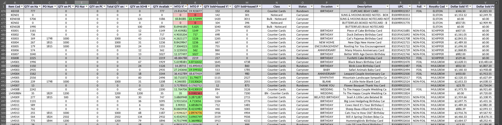
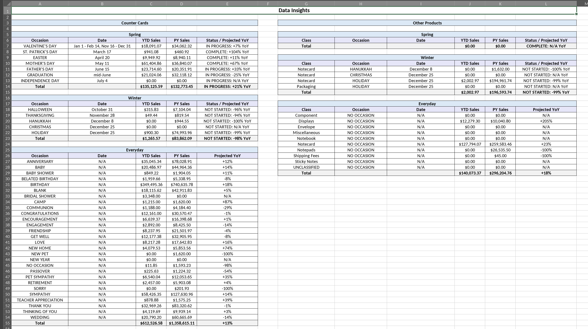

# Hotsheet Updater

## Description

Hotsheet Updater is a small Go GUI application built with `nucular` that generates unified Excel hotsheets from a Sage 100 "Item Listing With Sales History" inventory report and an optional PO report. For each product line found in the inventory report the app produces a single hotsheet file with three operational sheets (Everyday, Winter, Spring) plus a `Data Insights` summary sheet, includes per-PO details when available, and computes MTO (months-till-out) metrics. The `Data Insights` sheet now shows `Counter Cards` on the left and `Other Products` on the right. The right-hand side is split into Spring, Winter, and Everyday sections, uses the same holiday-date/projection rules as the card section, and now includes both class and occasion columns so class-specific seasonal items stay separated.

## Motivation

This tool automates the manual work of assembling hotsheets from inventory and PO reports, reducing errors and saving time.

## Screenshots

Below are screenshots of the generated sheets:

### Everyday sheet

### Data Insights sheet

## Requirements

- Go `1.26.2`
- `nucular` and the other Go module dependencies in `go.mod`
- Internet access is optional. The app checks for updates on startup when it can reach the public GitHub releases API, but it remains usable if the update check fails or there is no network connection.
- Native file pickers are launched through platform tools:
  - macOS: `osascript`
  - Windows: PowerShell / WinForms
  - Linux: `zenity` or `kdialog`

## Quick Start

1. Clone the repository and open the project root.
2. Build for your platform using one of the `Makefile` targets. Example targets:
   - `make windows-amd64`
   - `make windows-arm64`
   - `make linux-amd64`
   - `make linux-arm64`
   - `make darwin-arm64` (macOS ARM64)
   - `make all`
   - `make clean` (removes `bin`)

Built binaries are written to the `bin/` directory.

## Usage (GUI)

1. Run the binary. The main window titled `Hotsheet Generator` opens.
2. Fill in:
   - Inventory Report (required): path to the inventory XLSX produced by Sage 100.
   - PO Report (optional): path to the PO XLSX (if omitted per-PO columns are not written).
   - Output Directory (optional): where generated files will be written (defaults to the current working directory).
3. Click `Generate Hotsheets`. The app validates inputs, shows a modal progress popup, and performs the generation.
4. On success a `Created Hotsheets` modal popup lists generated files. Double-click an entry to open it, or use `Open Folder` to reveal the containing folder. Click `Done` to close the popup and clear the inputs to run again.
5. Use `Check for Updates` at any time to manually run the same optional update check that happens on startup.

Behavior notes

- Inventory report is required; PO report is optional. When no PO report is supplied the output omits PO columns.
- The PO parser captures up to two PO lines per SKU; additional quantities are accumulated into the first PO slot.
- PO-only SKUs (SKUs present in PO but not in inventory) are skipped to avoid creating `UNKNOWN` product-line files.
- Output file naming: `{ProductLine}_hotsheet_YYYYMMDD.xlsx` (for example, `BAS_hotsheet_20260423.xlsx`).
- Each output file contains four sheets: `Everyday`, `Winter`, `Spring`, and `Data Insights`. Header comments explain the MTO calculations.
- The `Data Insights` sheet now has two side-by-side areas: `Counter Cards` on the left and `Other Products` on the right. The right-hand side is stacked into Spring, Winter, and Everyday sections, groups non-card items by both class and occasion, and uses the same holiday-date/projection rules as the card rows.
- Valentine's Day remains the split-window exception: it uses the early-year and late-year selling windows rather than a single holiday date.

## Logs

The application writes JSON-formatted logs into a `logs-bsc` directory inside the OS temporary directory (`os.TempDir()`). Filenames include a timestamp and the logical logger name, with optional product/occasion suffixes. Example patterns produced by the logger:

- `2006-01-02_150405.000000000_name.log`
- `2006-01-02_150405.000000000_name-product-occasion.log`

Logger implementation: `helpers/slog_logger.go`. Callers must close the returned `io.Closer` to flush buffered entries (the code already defers `Close()`).

## Auto-update

On startup the GUI checks the public GitHub releases API for the latest version.

- If a newer release is detected, the app prompts the user and offers both `Update` and `Continue`.
- If the user chooses `Update`, the app downloads the release asset, replaces the running executable, and restarts the new binary.
- If the user chooses `Continue`, the current version remains usable and the app continues normally.
- If the update check fails (for example, no internet access), the app continues running and shows a non-blocking status message instead of preventing use.
- If an update attempt fails, the app shows an error popup but the current version remains usable.

## Implementation details

- Entry point: `main.go` sets up logging and launches the Nucular GUI via `internal/gui`.
- GUI: `internal/gui/app.go`, `internal/gui/state.go`, `internal/gui/actions.go`, `internal/gui/render_main.go`, and `internal/gui/render_popups.go` contain the immediate-mode UI, popups, input handling, and background-task coordination.
- Native dialogs and file opening: `internal/gui/native_dialogs.go` and `internal/gui/open.go` preserve native file pickers and platform-specific open behavior.
- Auto-update transport: `internal/update/service.go` checks the public GitHub releases API, selects the correct release asset for the active platform, applies updates, and restarts the executable.
- Hotsheet generation: `hotsheet/generate.go` exposes `hotsheet.Generate(...)` and orchestrates the report pipeline. The package is now split by responsibility: `hotsheet/inventory_reader.go` parses the inventory export, `hotsheet/po_reader.go` merges optional PO data, `hotsheet/product_line.go` groups entries by product line, `hotsheet/standard_sheets.go` writes the Everyday/Winter/Spring tabs, `hotsheet/data_insights_sheet.go` renders the `Data Insights` worksheet, `hotsheet/data_insights_rows.go` builds grouped Data Insights rows, `hotsheet/data_insights_projection.go` contains seasonal date/projection logic, `hotsheet/workbook.go` creates and saves workbooks, `hotsheet/styles.go` centralizes workbook styles, and `hotsheet/parsing.go`, `hotsheet/occasion.go`, and `hotsheet/entry.go` hold shared parsing, occasion mapping, and core model definitions.
- Logging: `helpers/slog_logger.go` creates buffered JSON writers into `logs-bsc` under the system temp directory.
- Version: `internal/version/version.go`.
- Build: `Makefile` provides cross-compile targets and passes explicit `nucular` backend tags per platform.

## Troubleshooting

- Auto-update failed: the app should still remain usable. Ensure internet connectivity if you want update checks/downloads to succeed, and ensure the app has permission to replace the executable if you choose to update.
- No logs: check your OS temp directory for a `logs-bsc` folder and file permissions.
- If a browse button fails to open a picker, ensure your platform dialog tool is available (`osascript` on macOS, PowerShell on Windows, `zenity` or `kdialog` on Linux).
- If you build manually without the expected `nucular` tag for your platform, the GUI may not use the intended backend. Prefer the provided `Makefile` or the explicit `go run -tags ...` examples above.
