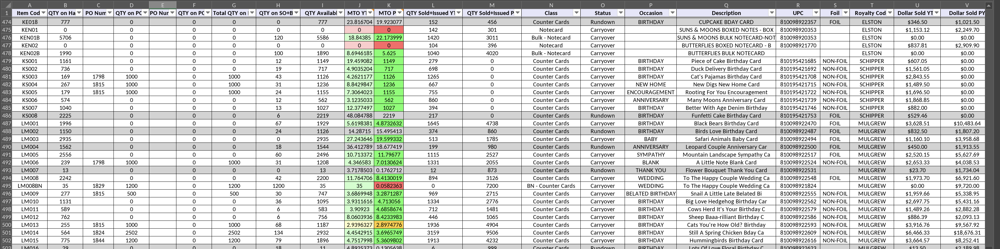
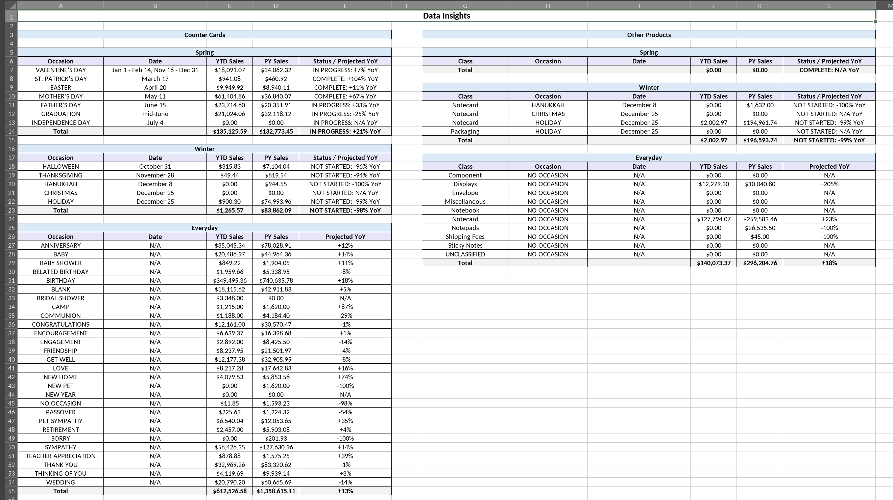

# Hotsheet Updater

## Description

Hotsheet Updater is a small Go GUI application built with `nucular` that generates unified Excel hotsheets from a Sage 100 "Item Listing With Sales History" inventory report, an optional PO report, and an optional sales history report. For each product line found in the inventory report the app produces a single hotsheet file with three operational sheets (Everyday, Winter, Spring) plus `Data Insights` and `Best Sellers` sheets and, when sales history is supplied, `Monthly History` and `MTO` sheets; it includes per-PO details when available and computes MTO (months-till-out) metrics. The `Data Insights` sheet now shows `Counter Cards` on the left and `Other Products` on the right. The right-hand side renders one table per non-card class, uses the same holiday-date/projection rules as the card section, and lists each class's occasions inside that class-specific table.

## Motivation

This tool automates the manual work of assembling hotsheets from inventory and PO reports, reducing errors and saving time.

## Screenshots

Below are screenshots of the generated sheets:

### Everyday sheet

### Data Insights sheet

## Requirements

- Go `1.26.2`
- `nucular` and the other Go module dependencies in `go.mod`
- Internet access is optional. The app checks for updates on startup when it can reach the public GitHub releases API, but it remains usable if the update check fails or there is no network connection.
- Native file pickers are launched through platform-native dialog systems:
  - macOS: `osascript`
  - Windows: native Common Item Dialog / shell APIs (no PowerShell dependency)
  - Linux: `zenity` or `kdialog`

## Quick Start

1. Clone the repository and open the project root.
2. Build for your platform using one of the `Makefile` targets. Example targets:
   - `make windows-amd64`
   - `make windows-arm64`
   - `make linux-amd64`
   - `make linux-arm64`
   - `make darwin-arm64` (macOS ARM64)
   - `make all`
   - `make clean` (removes `bin`)

Built binaries are written to the `bin/` directory.

## Usage (GUI)

1. Run the binary. The main window titled `Hotsheet Generator` opens.
2. Fill in:
   - Inventory Report (required): path to the inventory XLSX produced by Sage 100.
   - PO Report (optional): path to the PO XLSX (if omitted per-PO columns are not written).
   - Sales History (optional): path to the `IM_SalesHistory` XLSX (if omitted the `Monthly History` sheet is not written).
   - Best Sellers month range (optional, available after selecting Sales History): check the box and select From and To months and years. Both endpoint months are included. Without a checked range, Best Sellers uses inventory YTD sales even when a sales history report is selected.
   - Output Directory (optional): where generated files will be written (defaults to the current working directory).
3. Click `Generate Hotsheets`. The app validates inputs, shows a modal progress popup with a determinate progress bar, and performs the generation.
4. On success a `Created Hotsheets` modal popup lists generated files. Double-click an entry to open it, or use the Up/Down arrow keys to move through the list and press `Enter` to open the selected file. Hold `Option` on macOS (or `Alt` on other platforms) and press the bracketed letter in `Open Folder` or `Done` to open the selected file's folder or dismiss the popup. Press `Esc` to close the popup.
5. Throughout the main window, hold `Option` on macOS (or `Alt` on other platforms) and press the bracketed letter in the relevant label or button. The main form uses `I` for inventory report browsing, `P` for PO report browsing, `H` for sales history browsing, `O` for output directory browsing, `G` for generating hotsheets, `U` for checking for updates, and `Q` for quitting. On Windows the browse actions use the native Explorer-style Common Item Dialog instead of launching PowerShell.
6. When an update is available, hold `Option` on macOS (or `Alt` on other platforms) and press the bracketed `U` in `Update` or the bracketed `C` in `Continue`. Press `Esc` to close the popup as well. If you manually check for updates and you are already on the latest version, press the bracketed `O` in `OK` to dismiss the confirmation popup.

Behavior notes

- Inventory report is required; PO and sales history reports are optional. When no PO report is supplied the output omits PO columns. When no sales history report is supplied the output omits `Monthly History` and `MTO`.
- The PO parser captures up to two PO lines per SKU; additional quantities are accumulated into the first PO slot.
- PO-only SKUs (SKUs present in PO but not in inventory) are skipped to avoid creating `UNKNOWN` product-line files.
- Output file naming: `{ProductLine}_hotsheet_YYYYMMDD.xlsx` (for example, `BAS_hotsheet_20260423.xlsx`).
- Each output file contains `Everyday`, `Winter`, `Spring`, `Data Insights`, and `Best Sellers`, plus `Monthly History` and `MTO` when the optional sales history report is supplied. The existing operational-sheet MTO YTD/PY columns are unchanged.
- `Best Sellers` lists all inventory items in descending order of Quantity Sold (SKU breaks ties). It includes item code, description, quantity sold, dollars sold, quantity on hand, quantity committed (on sales orders plus on back order), quantity on PO, royalty code, class description, occasion, foil status, and status. Inventory quantities come from the current inventory report even when a sales month range is selected. Without a selected month range, it uses inventory Quantity Sold YTD and Dollars Sold YTD; with a range, it sums BSC sales-history Quantity Sold and Dollars Sold for the selected inclusive months, including across years. Zero-sale items remain at the bottom. Its header, status shading, and column filters match the other report sheets.
- `MTO` uses the sales-history run date as its snapshot date. It includes all undated POs in available quantity (`on hand + on PO - committed`, where committed is sales orders plus back orders) and forecasts BSC units sold only, not issued or returned units. Recent completed observations of each calendar month receive higher weights (up to three years); completed zeros after the first positive sale count, while pre-sale and partial current months do not. Forecast Demand is the next 12 calendar months' projected units; stockout and MTO are simulated month by month for up to 24 months. Partial months assume uniform daily sales. With at least two completed months since the first positive sale, calendar months without an observation use the average of all completed months (including zero-sale months); months with observations retain their recent-year weighted forecasts. With fewer than two completed months, the forecast shows `Insufficient history`. The sheet lists only non-Rundown, non-Discontinued inventory items, puts the earliest stockouts first, and has column filters and the standard header color. Its Class Description uses the standard sheets' SKU-prefix rules. Numeric MTO values use the lighter `MTO YTD` colors (red at ≤1 month, yellow through 3, green above 3); nonnumeric values such as `Insufficient history` remain uncolored. History Coverage shows completed observed months and years from the first positive sale, not a verified launch date. To test an additional order without changing baseline MTO, enter a nonnegative whole number in the yellow `Proposed PO Units` cell. `MTO with Proposed PO` and `Stockout Month with Proposed PO` recalculate in Excel from a hidden month-by-month forecast; blank means zero additional units, and results past the 24-month horizon show `>24` / `Not within 24 months`. Existing POs are already counted in Available Quantity. Both actual and proposed POs are assumed available immediately, which can make projected stockout optimistic.
- `Monthly History` lists BSC-warehouse values only: one row per item/year/metric, January–December in separate columns, and the inventory item's status in the last column. The sheet has filters on all columns and the same header and status shading as the standard sheets. Existing YTD/PY values and projections continue to come from the required inventory report.
- The `Data Insights` sheet now has two side-by-side areas: `Counter Cards` on the left and `Other Products` on the right. The right-hand side renders one table per non-card class, with the class shown in the table title and the rows grouped by occasion within that table. It still uses the same holiday-date/projection rules as the card rows.
- Valentine's Day remains the split-window exception: it uses the early-year and late-year selling windows rather than a single holiday date.

## Logs

The application writes JSON-formatted logs into a `logs-bsc` directory inside the OS temporary directory (`os.TempDir()`). Filenames include a timestamp and the logical logger name, with optional product/occasion suffixes. Example patterns produced by the logger:

- `2006-01-02_150405.000000000_name.log`
- `2006-01-02_150405.000000000_name-product-occasion.log`

Logger implementation: `helpers/slog_logger.go`. Callers must close the returned `io.Closer` to flush buffered entries (the code already defers `Close()`).

## Auto-update

On startup the GUI checks the public GitHub releases API for the latest version.

- If a newer release is detected, the app prompts the user and offers both `Update` and `Continue`.
- If the user chooses `Update`, the app downloads the release asset, replaces the running executable, and restarts the new binary.
- If the user chooses `Continue`, the current version remains usable and the app continues normally.
- If the update check fails (for example, no internet access), the app continues running and shows a non-blocking status message instead of preventing use.
- If an update attempt fails, the app shows an error popup but the current version remains usable.

## Implementation details

- Entry point: `main.go` sets up logging and launches the Nucular GUI via `internal/gui`.
- GUI: `internal/gui/app.go`, `internal/gui/state.go`, `internal/gui/actions.go`, `internal/gui/render_main.go`, and `internal/gui/render_popups.go` contain the immediate-mode UI, popups, input handling, determinate generation-progress display, and background-task coordination.
- Native dialogs and file opening: `internal/gui/native_dialogs.go`, `internal/gui/native_dialogs_nonwindows.go`, `internal/gui/native_dialogs_windows.go`, `internal/gui/open.go`, and `internal/gui/open_windows.go` preserve native file pickers and platform-specific open behavior. Windows now uses the Common Item Dialog for both file and folder browsing and `ShellExecuteW` for opening files/folders without spawning a terminal window.
- Auto-update transport: `internal/update/service.go` checks the public GitHub releases API, selects the correct release asset for the active platform, applies updates, and restarts the executable.
- Hotsheet generation: `hotsheet/generate.go` exposes `hotsheet.Generate(...)`, accepts an optional progress callback for coarse determinate progress updates, and orchestrates the report pipeline. The package is now split by responsibility: `hotsheet/inventory_reader.go` parses the inventory export, `hotsheet/po_reader.go` merges optional PO data, `hotsheet/sales_history_reader.go` streams optional BSC monthly sales into the item model, `hotsheet/monthly_history_sheet.go` writes the optional history sheet, `hotsheet/best_sellers.go` ranks the inventory and writes Best Sellers, `hotsheet/mto_forecast.go` models seasonal stockout and `hotsheet/mto_sheet.go` writes the MTO tab, `hotsheet/product_line.go` groups entries by product line, `hotsheet/standard_sheets.go` writes the Everyday/Winter/Spring tabs, `hotsheet/data_insights_sheet.go` renders the `Data Insights` worksheet, `hotsheet/data_insights_rows.go` builds grouped Data Insights rows, `hotsheet/data_insights_projection.go` contains seasonal date/projection logic, `hotsheet/workbook.go` creates and saves workbooks, `hotsheet/styles.go` centralizes workbook styles, and `hotsheet/parsing.go`, `hotsheet/occasion.go`, and `hotsheet/entry.go` hold shared parsing, occasion mapping, and core model definitions.
- Logging: `helpers/slog_logger.go` creates buffered JSON writers into `logs-bsc` under the system temp directory.
- Version: `internal/version/version.go`.
- Build: `Makefile` provides cross-compile targets and passes explicit `nucular` backend tags per platform.

## Troubleshooting

- Auto-update failed: the app should still remain usable. Ensure internet connectivity if you want update checks/downloads to succeed, and ensure the app has permission to replace the executable if you choose to update.
- No logs: check your OS temp directory for a `logs-bsc` folder and file permissions.
- If a browse button fails to open a picker, ensure your platform dialog support is available (`osascript` on macOS, built-in Windows shell/Common Item Dialog support on Windows, `zenity` or `kdialog` on Linux).
- If you build manually without the expected `nucular` tag for your platform, the GUI may not use the intended backend. Prefer the provided `Makefile` or the explicit `go run -tags ...` examples above.
